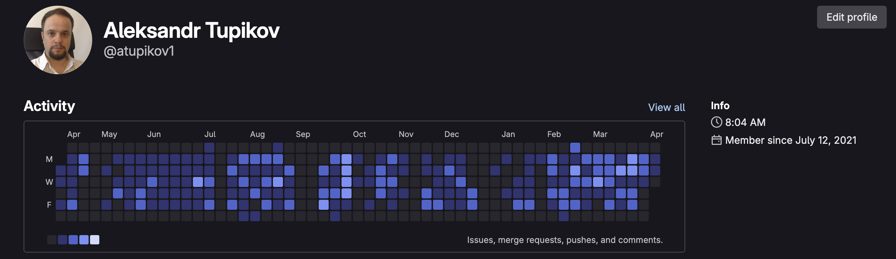

## Grace and peace to you! <><



My work activity is primarily focused on GitLab, where I contribute to various projects as a Team/Tech Lead and Senior Software Engineer.

---

### About Me

Hi, I'm **Aleksandr**, an experienced **Team/Tech Lead** and **Senior Software Engineer** with over 20 years in IT. I specialize in software development, team management, and Agile methodologies.

---

### Key Skills

- **Languages**: Golang, PHP, JavaScript
- **Frameworks & Technologies**: Zend Framework, Phalcon, Symfony, Doctrine, RabbitMQ, Angular, Vue.js
- **Tools**: Docker, Kubernetes, Codeception, CI/CD, Prometheus, Grafana
- **Databases**: MySQL, PostgreSQL, MongoDB, ClickHouse, Redis, Solr, Sphinx
- **Cloud Services**: AWS, Google Cloud, Azure

---

### Experience

- Team/Tech Lead
- Senior/Lead Software Developer
- Agile Coach
- CTO
- Head of Software Development
- Project Manager/Analyst/Software Engineer

---

### Certifications

- Scrum, Kanban, SAFe, LeSS Practitioner
- Agile Coach, Agile Team Facilitator
- Agile Programming

```